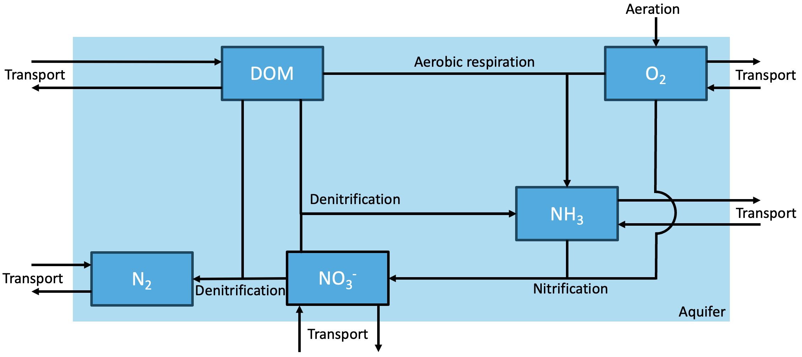

## Model concept {#con}

In this model, the processes involved in organic matter mineralization are simplified to a subset of three main reactions. While the full nitrogen cycle is more involved, including processes such as anammox, these are beyond the scope of the current project.

\begin{equation}
\label{eq:1}
(CH_2O)(NH_3)_{NC} + O_2 \rightarrow CO_2 + H_2O + NC \cdot NH_3
\end{equation}

\begin{equation}
\label{eq:2}
(CH_2O)(NH_3)_{NC} + \frac{4}{5}NO_3^- + \frac{4}{5}H^+ \rightarrow CO_2 + \frac{7}{5}H_2O + \frac{2}{5}N_2 + NC \cdot NH_3
\end{equation}

\begin{equation}
\label{eq:3}
NH_3 + 2O_2 \rightarrow NO_3^- + H_2O + H^+
\end{equation}

Equation \ref{eq:1} describes the reaction of the process of aerobic mineralization, with $NC$ standing for the nitrogen to carbon ratio in organic matter, also known as the Redfield ratio (16/106). As this is the energetically most favorable reaction, microbes will use oxygen as an electron acceptor first for the organic matter degradation. The process, therefore, is limited by the amount of available oxygen [@Tesoriero2011]. Equation \ref{eq:2} is the reaction for denitrification. For this process, nitrate availability is the limiting component. Only when the conditions become anoxic, or nearly anoxic, nitrate is used as an electron acceptor; therefore, oxygen concentration is an inhibiting component of this reaction. Both aerobic mineralization and denitrification are considered to be first-order processes with respect to the DOM concentration. Nitrogen is fixed in both of these reactions and released in the form of ammonia. Through the process of nitrification (equation \ref{eq:3}), this can be converted back into nitrate, although only under oxic conditions. This is mediated by nitrifying bacteria. Through the process of aeration, atmospheric oxygen dissolves into the aquifer water up to the saturation concentration of oxygen, dependent on the salinity, temperature, and the partial pressure of oxygen in the atmosphere.

\begin{equation}
\label{eq:4}
R_{aerobic\:mineralization} = r_{aerobic\:mineralization} \cdot \frac{[O_2]}{[O_2] + k_{O_2}} \cdot [DOM]
\end{equation}

\begin{equation}
\label{eq:5}
R_{dentrification} = r_{denitrification} \cdot \frac{[NO_3^-]}{[NO_3^-] + k_{NO_3^-}} \cdot \frac{k_{O_2}}{[O_2] + k_{O_2}} \cdot [DOM]
\end{equation}

\begin{equation}
\label{eq:6}
R_{nitrification} = r_{nitrification} \cdot [O_2] \cdot [NH_3]
\end{equation}

\begin{equation}
\label{eq:7}
R_{aeration} = r_{aeration} \cdot (O_{2,solubility} - [O_2])
\end{equation}

Equation \ref{eq:4} and \ref{eq:5} give the reaction rates ($R$) of aerobic mineralization and denitrification respectively [$mol:DOM: m^{-3}h^{-1}$]. Equation \ref{eq:6} gives the reaction rate of nitrification [$mol:NH_3:m^{-3}h^{-1}$]. Equation \ref{eq:7} gives the rate of aeration in the aquifer [$mol:O_2:m^{-3}h^{-1}$]. In these rate equations, $r$ stands for the rate constants [$h^{-1}$] of the respective reactions. The $k$ stands for the Michaelis-Menten rate limitation term of the respective reactant. The term $O_{2,solubility}$ is the solubility of oxygen in the aquifer water.

The model developed in this study takes into account five state variables; DOM, O2, NO3^-^, NH3 and N2, given in $mol:m^{-3}$ of their respective molecules. Other molecule concentrations involved in the reactions are not considered in this model implementation; therefore, C and H^+^. Although aerobic mineralization, denitrification, and nitrification are mediated by microbes, any change of biomass due to these processes is deemed to be negligible compared to the concentrations in the aquifer water. This all leads to a conceptual model figure \ref{fig:concept}.

```{r concept, fig.align = "center", fig.cap = "Conceptual diagram of the bank infiltration model.", echo = FALSE}

```

For the transport processes, 1-dimensional flow from the river through the aquifer is assumed. Considering the time and spatial scales involved, diffusion processes can be ignored compared to advection and dispersion processes. The porosity is taken as constant over the length of the aquifer. The upper boundary condition (at the river-subsurface interface) is taken as the respective river concentrations of the state variables, thus a constant concentration boundary condition. The lower boundary condition (at the end of the modeled aquifer length) is a zero concentration gradient.

\begin{equation}
\label{eq:8}
\frac{\partial [DOM]}{\partial t} = Transport(DOM) - R_{aerobic\:mineralization} - R_{denitrification}
\end{equation}

\begin{equation}
\label{eq:9}
\frac{\partial [O_2]}{\partial t} = Transport(O_2) + R_{aeration} - R_{aerobic\:mineralization} - 2 \cdot R_{nitrification}
\end{equation}

\begin{equation}
\label{eq:10}
\frac{\partial [NO_3^-]}{\partial t} = Transport(NO_3^-) - \frac{4}{5} \cdot R_{dentrification} + R_{nitrification}
\end{equation}

\begin{equation}
\label{eq:11}
\frac{\partial [NH_3]}{\partial t} = Transport(NH_3) + \frac{16}{106} \cdot (R_{aerobic\:mineralization} + R_{dentrification}) - R_{nitrification}
\end{equation}

\begin{equation}
\label{eq:12}
\frac{\partial [N_2]}{\partial t} = Transport(N_2) + \frac{2}{5} \cdot R_{denitrification}
\end{equation}

Equations \ref{eq:8}, \ref{eq:9}, \ref{eq:10}, \ref{eq:11} and \ref{eq:12} give the mass balances of DOM, oxygen, nitrate, ammonia and molecular nitrogen. Each in $mol\:m^{-3}\:h^{-1}$ of the respective state variable. The mass balance equations are used to calculate the change in concentration of the state variables over the length of the aquifer.

## Model implementation {#impl}

The model is implemented in R [@R2021] as follows.

```{r, message = FALSE, include = FALSE}
require(marelac)
require(ReacTran)
```

The model grid is setup using the ReacTran package [@Soetaert2012]. The aquifer has a length of 500 m and is difided into 500 cells, each of one meter.

```{r}
# units: time=hours, space=meters, amount=moles, concentration=mol/m3

# Spatial domain of aquifer
Length    <- 500   # Length of model grid (i.e. aquifer length [m]
N         <- 500   # number of grid cells

# grid with equally sized boxes
Grid      <- setup.grid.1D(L = Length, N = N)

```

The parameters not varying in space are defined. The solubility of oxygen in water is calculated using the marelac package [@Soetaert2023].

```{r}
temp         <- 10        # Temperature in degrees
salinity     <- 0         # Salinity
O2_sol       <- gas_solubility(S = salinity, t = temp, species = "O2") / 1000 * 0.21 # Oxygen solubility, compensated for the partial pressure of oxygen in the atmosphere (~21%)

f            <- 1/1000    # Factor to convert from µM to mol/m3

def.pars <- c(
 r_aeromin   = 0.002,     # [/h]            Aerobic mineralization rate constant 
 r_denitr    = 0.002,     # [/h]            Denitrification rate constant 
 r_nitri     = 0.36,      # [/(mol/m3) /h]  Nitrification rate constant   
 r_aera      = 0.0003,    # [/h]            Aeration rate constant
 Length      = 500,       # [m]             Modelled length of aquifer
 v_adv       = 10 / 100,  # [m/h]           Transport velocity
 a           = 1.5,       # [m]             Dispersivity
 kO2         = 20 * f,    # [mol/m3]        The affinity constant in the Michaelis-Menten rate limitation term for O2
 kNO3        = 35 * f,    # [mol/m3]        The affinity constant in the Michaelis-Menten rate limitation term for NO3
 riverDOM    = 6/12e-3*f, # [mol/m3]        River dissolved organic matter
 riverO2     = 210 * f,   # [mol/m3]        River oxygen concentration
 riverNO3    = 100 * f,   # [mol/m3]        River Nitrate concentration 
 riverNH3    = 0 * f,     # [mol/m3]        River oxygen concentration
 O2_sol      = O2_sol,    # [mol/m3]        Solubility of oxygen
 por         = 0.4        # [-]             Porosity
)

```

State variables are defined, the initial conditions for each concentration in the aquifer is 0.

```{r}
# Create a vector for each state variable of length N which contains the initial condition
DOM       <- rep(0, times = N)
Oxygen    <- rep(0, times = N)
Nitrate   <- rep(0, times = N)
Ammonia   <- rep(0, times = N)
Nitrogen  <- rep(0, times = N)

# Save the state variables as one long vector and make a vector with their respective names
state.ini <- c(DOM, Oxygen, Nitrate, Ammonia, Nitrogen)
SVnames   <- c("DOM", "Oxygen", "Nitrate", "Ammonia", "Nitrogen")
nspec     <- length(SVnames)

```

A model is defined that calculates transport, reaction rate and concentration change for a time step.

```{r}

AquiModel <- function (t, state, parms)
{
  with (as.list(parms),{ 
    
    # Unpacking state variables 
    DOM      <- state[ (0*N+1) : (1*N) ]    # Next N elements: DOM
    O2       <- state[ (1*N+1) : (2*N) ]    # Next N elements: O2    
    NO3      <- state[ (2*N+1) : (3*N) ]    # Next N elements: NO3
    NH3      <- state[ (3*N+1) : (4*N) ]    # Next N elements: NH3
    N2       <- state[ (4*N+1) : (5*N) ]    # Last N elements: N2

    # === transport rates ===
    # Transport by dispersion and advection 
    # Lower boundaries are zero gradient by default
 
    tran.DOM <- tran.1D(C = DOM, C.up = riverDOM,    # upper boundary: fixed concentration
                        dx = Grid, VF = por,         # grid and volume fraction (por)
                        D = a * v_adv, v = v_adv)    # dispersion (dispersivity * flow velocity) and advection

    tran.O2 <- tran.1D(C = O2, C.up = riverO2,      
                        dx = Grid, VF = por,         
                        D = a * v_adv, v = v_adv)     
                                                    
    tran.NO3 <- tran.1D(C = NO3, C.up = riverNO3,    
                        dx = Grid, VF = por,         
                        D = a * v_adv, v = v_adv)    
                                                     
    tran.NH3 <- tran.1D(C = NH3, C.up = riverNH3,    
                        dx = Grid, VF = por,         
                        D = a * v_adv, v = v_adv)    
    
    tran.N2 <- tran.1D(C = N2, C.up = 0,             
                        dx = Grid, VF = por,         
                        D = a * v_adv, v = v_adv)    
 
    # === reaction rates ===
    
    # DOM mineralisation, first order relation with DOM concentration, limited by oxygen concentration
    aeroMin <- r_aeromin * (O2 / (O2 + kO2)) * DOM
    
    # Denitrification, first order relation with DOM concentration, limited by nitrate concentration, inhibited by oxygen concentration
    denitri <- r_denitr * (NO3 / (NO3 + kNO3)) * (kO2 / (O2 + kO2)) * DOM
    
    # Nitrification, first order relation with oxygen and ammonia
    nitri   <- r_nitri * O2 * NH3
  
    # Aeration rate, calculated as the difference between the maximum solubility of oxygen and oxygen concentration
    aeration <- r_aera * (O2_sol - O2) 
    
    # === mass balances : dC/dt = transport + reactions ===
    
    dDOM.dt  <- ( tran.DOM$dC -                         # transport
                aeroMin - denitri)                      # reactions, [mol DOM /m3]
    
    dO2.dt   <- ( tran.O2$dC + aeration                 # transport
                - aeroMin - 2 * nitri)                  # reactions, [mol O2 /m3]
        
    dNO3.dt  <- ( tran.NO3$dC -                         # transport
                   4/5 * denitri + nitri)               # reactions, [mol NO3 /m3]
            
    dNH3.dt  <- ( tran.NH3$dC +                         # transport
                  (aeroMin + denitri) * 16/106 - nitri) # reactions, [mol NH3 /m3]
    
    dN2.dt   <- ( tran.N2$dC +                          # transport
                  + 2/5 * denitri)                      # reactions, [mol N2 /m3]

    # Reaction rates integrated over aquifer length
    TotalAeroDeg      = sum(aeroMin * Grid$dx * por)    # [mol DOM /m2 /h]
    TotalDenitri      = sum(denitri * Grid$dx * por)    # [mol DOM /m2 /h]
    TotalNitri        = sum(nitri * Grid$dx * por)      # [mol NH3 /m2 /h]
    TotalAeration     = sum(aeration * Grid$dx * por)   # [mol O2  /m2 /h]
  
    return(list(c(dDOM.dt, dO2.dt, dNO3.dt, dNH3.dt, dN2.dt), # The time-derivatives, as a long vector
          
          # Reaction rates            
          Aerobic_mineralisation = aeroMin,             # Aerobic mineralisation rate [mol DOM /m3 /h]
          Denitrification   = denitri,                  # Denitrification rate [mol DOM /m3 /h]
          Nitrification     = nitri,                    # Nitrification rate [mol NH3 /m3 /h]
          Aeration          = aeration,                 # Aeration rate [mol O2 / m3 / h]
          
          # Aquifer integrated reaction rates for budget
          TotalAeroDeg      = TotalAeroDeg,             # [mol DOM /m2 /h]
          TotalDenitri      = TotalDenitri,             # [mol DOM /m2 /h]
          TotalNitri        = TotalNitri,               # [mol NH3 /m2 /h]
          TotalAeration     = TotalAeration,            # [mol O2 /m2 /h]
          
          # Transport fluxes at system boundaries for budget 
          DOM.up.Flux       = tran.DOM$flux.up,         # [mol DOM /m2 /h]
          DOM.down.Flux     = tran.DOM$flux.down,       # [mol DOM /m2 /h]
          O2.up.Flux        = tran.O2$flux.up,          # [mol O2 /m2 /h]
          O2.down.Flux      = tran.O2$flux.down,        # [mol O2 /m2 /h]
          NO3.up.Flux       = tran.NO3$flux.up,         # [mol NO3 /m2 /h]
          NO3.down.Flux.    = tran.NO3$flux.down,       # [mol NO3 /m2 /h]
          NH3.up.Flux       = tran.NH3$flux.up,         # [mol NH3 /m2 /h]
          NH3.down.Flux     = tran.NH3$flux.down,       # [mol NH3 /m2 /h]
          N2.up.Flux        = tran.N2$flux.up,          # [mol N2 /m2 /h]
          N2.down.Flux      = tran.N2$flux.down))       # [mol N2 /m2 /h]
 })
}
```

To find the steady state solution, the function steady.1D from the rootSolve package is used [@Soetaert2009_1, @Soetaert2009_2].

```{r}

def.std <- steady.1D (y = state.ini, func = AquiModel, parms = def.pars, 
                     nspec = nspec, dimens = N, names = SVnames, 
                     positive = TRUE, atol = 1e-10, rtol = 1e-10)
```

The system budget is evaluated by getting fluxes from the steady state solution

```{r eval = FALSE}
# Select which output form the steady state solution to include in the budget
toselect <- c("TotalAeroDeg", "TotalDenitri", "TotalNitri", "TotalAeration", "DOM.up.Flux", "DOM.down.Flux", "O2.up.Flux", "O2.down.Flux", "NO3.up.Flux", "NO3.down.Flux", "NH3.up.Flux", "NH3.down.Flux", "N2.up.Flux", "N2.down.Flux")
BUDGET   <- def.std[toselect]
unlist(BUDGET)    # display BUDGET as a vector with named elements rather than a list
```

For parameter calibration, load in the field data, to be plotted against the default parameters. The R package shiny was used for this purpose [@Chang2024]. The shiny package allows the user to generate an environment where the parameters can be changed interactively by the use of sliders. By visual examination, the parameters were changed to correspond with the field data. For the code used in the shiny application, see the [appendix](#shiny).

```{r}

# Load in the data file with field data, to be used to calibrate the parameters. Set working directory to the folder with the field data to make this work properly

aquifer_fielddata <- read.csv("./aquifer_fielddata.txt") 
```

```{r include = FALSE}

# Make vectors for the variables to be plotted, the y-axis names and the safety concentrations of some of the state variables
plt_variables <- c("DOM", "Oxygen", "Nitrate", "Ammonia", "Nitrogen", "Aerobic_mineralisation", "Denitrification", "Nitrification")
plt_ylabel <- c("mol DOM /m3", "mol O2 /m3", "mol NO3 /m3", "mol NH3 /m3", "mol N2 /m3", "mol DOM /m3 /h", "mol DOM /m3 /h", "mol NH3 /m3 /h")
plt_savelimit <- c(2.498e-1, 0, 4.032e-1, 2.937e-3, 0, 0, 0, 0)

# Make a plot with a 3x3 matrix
par(mfrow = c(3, 3))

# Loop over the to be plotted variables and plot every single one with their respective y-axis labels
for (i in 1:length(plt_variables)) {
  plt_variables[i]
  plot(def.std, grid=Grid$x.mid, 
       lty=1, lwd=2,
       which = plt_variables[i], mfrow=NULL,
       ylab  = plt_ylabel[i],  
       xlab  = "distance (m)",
       cex.main = 1.5, cex.axis = 1.25, cex.lab = 1.25)
  
  # If statements state plot the field data and water safety concentrations for the right variables
  if (plt_variables[i] == "DOM") {
     points(aquifer_fielddata$distance_m, aquifer_fielddata[[plt_variables[i]]] / (16/106),  col = 3)
  }
  
  if (plt_variables[i] %in% c("Oxygen", "Ammonia")) {
     points(aquifer_fielddata$distance_m, aquifer_fielddata[[plt_variables[i]]],  col = 3)
  }
  
  if (plt_variables[i] %in% c("DOM", "Nitrate", "Ammonia")) {
     abline(h = plt_savelimit[i], col = 4)
  }
}

# Plot the legend in the remaining panel of the matrix
plot.new()

legend("topright", legend = c("steady", "field", "savety"), 
       lty = c(1, -1, 1), lwd = c(2, 1, 2), pch = c(-1, 1, -1), col = c(1,3,4),
       cex = 1.5)
```

For the sensitivity analysis, code was written that gets the value of the NH~3~ concentration at a distance of 200m from the river, for different parameter values. These graphs give information about the effect of fluctuations on the water quality in the aquifer.

```{r}
# make a function with as input a parameter value and the name of that parameter
sens <- function(parameter, par_name){
  # save the parameters in a new vector
  pars.sens <- def.pars
  # change the value of the parameter
  pars.sens[par_name] <- parameter
  
  # calculate the steady state solution with the changed paramter
  sens <-    steady.1D (y=state.ini, func=AquiModel, parms=pars.sens, 
                       nspec=nspec, dimens=N, names=SVnames,
                       positive = TRUE, atol = 1e-10, rtol = 1e-10) 
  # return the concentration distribution of the ammonia state variable
  return((sens$y[,"Ammonia"]))
}

# make a vector with the range in which to vary the parameter
DOM_vect <- seq(from = 0, to = 0.7, length.out = 50)
# initialize the output array
NH3_DOM_vect <- NULL

# loop over every parameter value
for (riverDOM in DOM_vect){
  # run the sens function with the parameter value as input, which gives the concentration of ammonia over the aquifer
  model_output <- sens(riverDOM, "riverDOM")
  # determine the value at 200m by taking the average between 199.5m and 200.5m
  conc_200 <- (model_output[200] + model_output[201]) / 2
  #store this value in the output array
  NH3_DOM_vect <- c(NH3_DOM_vect, conc_200)
}

# repeat this process for three other parameter values to chance
NO3_vect <- seq(from = 0, to = 0.3, length.out = 50)
NH3_NO3_vect <- NULL

for (riverNO3 in NO3_vect){
  model_output <- sens(riverNO3, "riverNO3")
  conc_200 <- (model_output[200] + model_output[201]) / 2
  
  NH3_NO3_vect <- c(NH3_NO3_vect, conc_200)
}

NH3_vect <- seq(from = 0, to = 0.1, length.out = 50)
NH3_NH3_vect <- NULL

for (riverNH3 in NH3_vect){
  model_output <- sens(riverNH3, "riverNH3")
  conc_200 <- (model_output[200] + model_output[201]) / 2
  
  NH3_NH3_vect <- c(NH3_NH3_vect, conc_200)
}

aera_vect <- seq(from = 0, to = 0.0006, length.out = 50)
NH3_aera_vect <- NULL

for (r_aera in aera_vect){
  model_output <- sens(r_aera, "r_aera")
  conc_200 <- (model_output[200] + model_output[201]) / 2
  
  NH3_aera_vect <- c(NH3_aera_vect, conc_200)
}
```

For the method section as an .Rmd file (and all the other sections of the report), see ***[GitHub](https://github.com/JoYvBa/RTM)***, where it is publicly accessible.