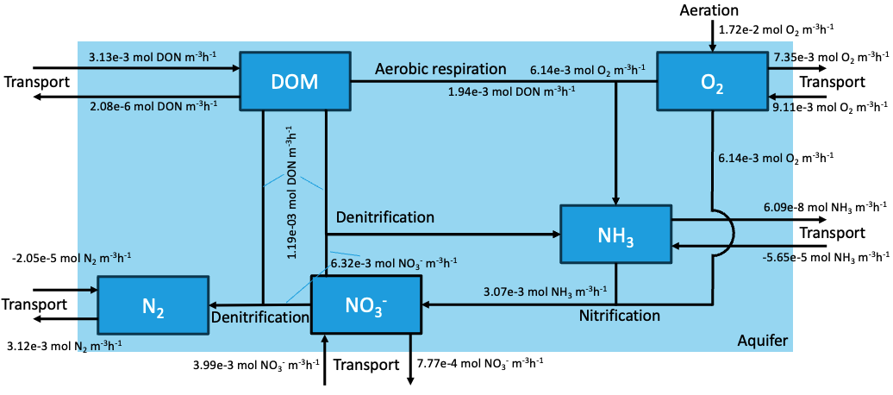

## Zonation and shape {#zonshap}

The steady-state condition of the system shows the spatial distribution of concentrations and process rates after the system has set into equilibrium (Figure 2). This gives insight into the different processes occurring along the length of the aquifer and how they interact.

The aerobic mineralization rate is high in the beginning of the aquifer; however, over a distance of 50m, it quickly drops off. This is due to the process consuming oxygen, thereby limiting its own reaction rate. Moving further from the river, after its initial convex decrease, it flattens out and very slowly decreases over the remaining length of the aquifer, as the organic matter is almost depleted.

The denitrification rate rises from the river to 50m into the aquifer, where it peaks and subsequently decreases in a convex manner. As denitrification is oxygen-inhibited, the initially high oxygen concentration slows the process until most of the oxygen is exhausted by aerobic mineralization. The rate of denitrification peters off due to the nitrate and organic matter depleting.

The nitrification rate is dependent on the oxygen and ammonia concentrations present in the aquifer. An increase in the beginning of the aquifer is followed by a sharp drop-off due to the decrease in oxygen concentration. This is then followed by a slight comeback due to the increasing ammonia concentrations caused by aerobic mineralization and denitrification. Afterwards, the nitrification rate settles and nears zero as the ammonia is depleted.

The aeration rate is dependent on the difference between oxygen concentration and oxygen saturation level. As oxygen is depleted by aerobic mineralization, the aeration rate increases to a maximum while the oxygen concentration remains near zero. Once the oxygen-consuming processes slow down due to low concentrations of organic matter and ammonia, the aeration rate decreases for the rest of the aquifer. As oxygen concentration is inversely related to the aeration rate, the shape of the aeration rate in the aquifer is the shape of the oxygen concentration flipped.

The DOM is introduced into the aquifer through the river, giving an initially high concentration before dropping off as it continues through the aquifer. This is due to it being consumed via denitrification. This gives the depth profile its convex shape.

The Oxygen profile demonstrates a convex shape with the oxygen concentration dropping as a result of the oxygen being required for the nitrification and aerobic mineralization processes. As these processes end, the concentration of oxygen is able to recover to its normal level.

The nitrate profile initially shows a concave profile before becoming a convex profile. This is due to the already existing concentration of nitrate in the system being added to from the river; however, this drops off due to the denitrification process taking place in the system.

The ammonia concentration rises from a concentration value of zero from the processes of aerobic mineralization and denitrification. This abundance of ammonia is then used in the nitrification process, forming nitrate, giving the curve its concave shape.

The Nitrogen concentration profile forms a concave curve due to its continual increase due to the denitrification coming from the dissolved organic nitrogen pool and the nitrate pool. This increase continues until both pools are exhausted.

```{r zone, echo = FALSE, fig.cap = "Concentration and rate profiles over the aquifer length."}
# Make vectors for the variables to be plotted and the y-axis names
plt_variables <- c("DOM", "Oxygen", "Nitrate", "Ammonia", "Nitrogen", "Aerobic_mineralisation", "Denitrification", "Nitrification", "Aeration")
plt_title <- c("DOM", "Oxygen", "Nitrate", "Ammonia", "Nitrogen", "Aerobic_mineralisation", "Denitrification", "Nitrification", "Aeration")
plt_ylabel <- c(expression(paste("mol DOM m"^"-3")), expression(paste("mol O"["2"], " m"^"-3")), expression(paste("mol NO"["3"]^"-", " m"^"-3")), expression(paste("mol NH"["3"]," m"^"-3")), expression(paste("mol N"["2"]," m"^"-3")), expression(paste("mol DOM m"^"-3","h"^"-1")), expression(paste("mol DOM m"^"-3","h"^"-1")), expression(paste("mol NH"["3"]," m"^"-3","h"^"-1")), expression(paste("mol O"["2"], " m"^"-3","h"^"-1")))

# Make a plot with a 3x3 matrix and set graphing parameters
par(mar = c(2.5, 3, 2, 0.5),
    mgp=c(1.5,0.5,0),
    mfrow = c(3, 3))  

# Loop over the to be plotted variables and plot every single one with their respective y-axis labels
for (i in 1:length(plt_variables)) {
  plt_variables[i]
  plot(def.std, grid = Grid$x.mid, 
       lty = 1, lwd = 2,
       main = plt_title[i],
       ylab  = plt_ylabel[i],
       xlab = "distance (m)",
       which = plt_variables[i], mfrow=NULL,
       cex.main = 1.5, cex.axis = 1.25, cex.lab = 1.25)
}

```

## Budgets

A budget of the system is set up to evaluate the fate of the state variables in the system (Table 1). These fluxes can be further visualized in the conceptual diagram of the system (Figure 3).

```{r budget, echo = FALSE}
# Select which output form the steady state solution to include in the budget
toselect <- c("TotalAeroDeg", "TotalDenitri", "TotalNitri", "TotalAeration", "DOM.up.Flux", "DOM.down.Flux", "O2.up.Flux", "O2.down.Flux", "NO3.up.Flux", "NO3.down.Flux", "NH3.up.Flux", "NH3.down.Flux", "N2.up.Flux", "N2.down.Flux")
BUDGET   <- def.std[toselect]
BUDGET <- data.frame(flux     = unlist(BUDGET))
knitr::kable(BUDGET, digits = 4, caption = "Budget for the bank infiltration model. Unit of fluxes are in mol m-3 h-1 of their respective state variable.")    
```

```{r conbud, fig.align = "center", fig.cap = "Conceptual diagram of the bank infiltration model with process fluxes", echo = FALSE}

```

The amount of oxygen coming in from the river and the oxygen supplied by aeration give the total amount of oxygen supplied to the system. Aerobic mineralization and nitrification both consume oxygen, the latter of which at two molecules per reaction. Therefore, the amount of oxygen used for aerobic matter mineralization is 49% of the total oxygen supplied, 28% is used for nitrification, and the rest is transported out of the aquifer.

The amount of organic material making its way into the aquifer is 0.021 mol m^-3^ h^-1^; using the Redfield ratio, this is 3.13e-3 mol DON m^-3^ h^-1^. Of this, 62% is consumed by means of aerobic mineralization, and 38% by denitrification.

Nitrate enters the system by supply from the river and by the process of nitrification. About 3.99e-3 mol NO3^-^ m^-3^ h^-1^ is supplied by the river, while 3.07e-3 mol NO3^-^ m^-3^ h^-1^ is formed in the aquifer by nitrification. 89% of this is transformed back into ammonia by denitrification, and the remaining 11% is transported away.

The amount of N entering the aquifer is the sum of nitrate and DON entering the system, equal to 7.12e-3 mol N m^-3^ h^-1^. The fate of nitrogen is to either be transported out of the system as nitrate, DOM or ammonia, or be converted to molecular nitrogen and then be transported out. There is 6.28e-3 mol N m^-3^ h^-1^ leaving the system as molecular nitrogen (double the outflow flux of N~2~ because each molecule contains two N atoms). Therefore, 88% of the fixed nitrogen entering the aquifer is converted to molecular nitrogen.

## Fitting to field data

The model output with the default parameters differs substantially from field data (Figure 4). The field data show slightly lower DOM levels across the aquifer, and the oxygen concentration in the further reaches of the aquifer increases slower. Lastly, the ammonia concentration peaks further into the aquifer in the field and is more spread out than with the default model parameters.

The aeration and nitrification rate constant and the river DOM concentration were adapted to fit the model with the default parameters to the field data (Table 2). Reducing the river DOM concentration decreases the river boundary concentration of DOM and consequently, the concentration across the first half of the aquifer. This increases oxygen concentration across the whole aquifer, since less oxygen is consumed by aerobic mineralization. Furthermore, less ammonia is produced by aerobic mineralization and denitrification, reducing its concentration. By reducing the aeration rate constant, less oxygen is replenished over the aquifer length. In turn, this causes less ammonia to be converted to nitrate by nitrification, increasing the ammonia concentration. Lastly, decreasing the nitrification rate constant further increases the ammonia concentration in the aquifer. These changes in parameter fitted the field data the best.

```{r include = FALSE}
fit.pars <- def.pars
fit.pars["r_nitri"]    <- 0.19
fit.pars["r_aera"]     <- 0.00009
fit.pars["riverDOM"]   <- 0.36

fit.std <- steady.1D (y = state.ini, func = AquiModel, parms = fit.pars, 
                     nspec = nspec, dimens = N, names = SVnames, 
                     positive = TRUE, atol = 1e-10, rtol = 1e-10)
```

```{r fitting, echo = FALSE, fig.cap = "Concentrations for three state variables , showing the steady state conditions for both default parameters and fitted parameters."}
# Make vectors for the variables to be plotted and the y-axis names
plt_variables <- c("DOM", "Oxygen", "Ammonia")
plt_ylabel <- c(expression(paste("mol DOM m"^"-3")), expression(paste("mol O"["2"], " m"^"-3")), expression(paste("mol NH"["3"]," m"^"-3")))

# Make a plot with a 2x2 matrix
par(mfrow = c(2, 2),
    mar = c(3, 4, 3.5, 1),
    mgp=c(1.5,0.5,0))

# Loop over the to be plotted variables and plot every single one with their respective y-axis labels
for (i in 1:length(plt_variables)) {
  plt_variables[i]
  plot(def.std, fit.std, grid=Grid$x.mid, 
       lty=1, lwd=2,
       which = plt_variables[i], mfrow=NULL,
       ylab  = plt_ylabel[i],  
       xlab  = "distance (m)",
       cex.main = 1.5, cex.axis = 1.25, cex.lab = 1.25)
  
  # If statements state plot the field data for the right variables
  if (plt_variables[i] == "DOM") {
     points(aquifer_fielddata$distance_m, aquifer_fielddata[[plt_variables[i]]] / (16/106),  col = 3)
  }
  
  if (plt_variables[i] %in% c("Oxygen", "Ammonia")) {
     points(aquifer_fielddata$distance_m, aquifer_fielddata[[plt_variables[i]]],  col = 3)
  }
  
}

# Plot the legend in the remaining panel of the matrix
plot.new()

legend("topleft", legend = c("default", "fitted", "field"), 
       lty = c(1, 1, -1), lwd = c(2, 2, 1), pch = c(-1, -1, 1), col = c(1,2,3),
       cex = 1.5)
```

```{r fit, echo = FALSE}
fitted <- data.frame(parameter     = c("riverDOM [mol DOM m-3]", "aeration rate [h-1]", "nitrification rate [/(mol/m3) h-1]"), 
                     default = c(0.5, 0.0003, 0.36),
                     fitted = c(0.36, 0.00009, 0.19))
knitr::kable(fitted, caption = "Default and fitted parameter values for the bank infiltration model.")
```

## Savety concentrations

While the nitrate concentration in the aquifer stays well below the safety concentration, elevated concentrations of organic matter and ammonia make the water unsafe for human consumption in the first 200m of the aquifer (Figure 5). The first 50m of the aquifer have too high organic matter concentrations, due to the river concentration. Aerobic mineralization and denitrification break down the organic matter but produce ammonia, which is subsequently elevated to concentrations above the safety criteria for drinking water. Only once enough ammonia has been converted to nitrate by nitrification does the water become safe enough to drink. Therefore, any well used to extract drinking water from this aquifer should be located at least 200 m from the river.

```{r savety, echo = FALSE, fig.cap = "Concentration profiles of three state variables and their respecive drinking water savety concentrations. The savety concentration for nitrate (0.4 mol NO3- m-3) falls off the graph."}
# Make vectors for the variables to be plotted, the y-axis names and the safety concentrations of some of the state variables
plt_variables <- c("DOM", "Nitrate", "Ammonia")
plt_ylabel <- c(expression(paste("mol DOM m"^"-3")), expression(paste("mol NO"["3"]^"-", " m"^"-3")), expression(paste("mol NH"["3"]," m"^"-3")))
plt_savelimit <- c(2.498e-1, 4.032e-1, 2.937e-3)

# Make a plot with a 2x2 matrix
par(mfrow = c(2, 2),
    mar = c(3, 4, 3.5, 1),
    mgp=c(1.5,0.5,0))

# Loop over the to be plotted variables and plot every single one with their respective y-axis labels
for (i in 1:length(plt_variables)) {
  plt_variables[i]
  plot(def.std, grid=Grid$x.mid, 
       lty=1, lwd=2,
       which = plt_variables[i], mfrow=NULL,
       ylab  = plt_ylabel[i],  
       xlab  = "distance (m)",
       cex.main = 1.5, cex.axis = 1.25, cex.lab = 1.25)
  
  # If statements plot water safety concentrations for the right variables
  
  if (plt_variables[i] %in% c("DOM", "Nitrate", "Ammonia")) {
     abline(h = plt_savelimit[i], col = 4)
  }
}

# Plot the legend in the remaining panel of the matrix
plot.new()

legend("topleft", legend = c("steady", "savety"), 
       lty = c(1, 1), lwd = c(2,2), pch = c(-1, -1), col = c(1,4),
       cex = 1.5)
```

## Sensitivty analysis

When no denitrification is present in the water, the dissolved organic nitrogen increases, oxygen concentration decreases, nitrate concentration increases, and ammonia decreases in the short path of the water, but over a longer path, the concentration is higher than the default concentration. Nitrogen concentration remains zero, aerobic mineralization increases, and nitrification increases initially but decreases over time.

With aerobic mineralization being 0, there will be an increase in dissolved organic nitrogen and oxygen (Figure 6). Nitrate will decrease uniformly. Nitrogen concentration will be less than the default concentration. Denitrification and nitrification productivity will decrease and decline toward 0.

If the nitrification rate is 0, then the oxygen and ammonia concentrations will become higher relative to the default concentration where the nitrification rate is 0.36. Dissolved organic matter, nitrate, and nitrogen concentrations become less than the default concentrations. Aerobic mineralization increases relative to the default rate when the nitrification rate is 0. Nitrification becomes 0, and denitrification in the first 120 meters is still above 0 and then remains 0 along the distance from the aquifer.

For the aeration rate with a value of 0, the concentrations increase for dissolved organic matter and ammonia, while for oxygen, nitrate, and nitrogen, the concentrations become 0. The reactions for aerobic mineralization and nitrification decline toward a value of 0, while for denitrification, in the first 70 meters, the process occurs more often than the default rate of denitrification.

For dissolved organic matter concentrations in rivers with values below 0.5 [mol m^-3^], the water is suitable for human consumption. When the values go above 0.5 [mol m^-3^], the river will have too much ammonia in the water, making it unsuitable for human consumption. Range: DOM <= 0.5 [mol m^-3^].

```{r sens, echo = FALSE, fig.cap = "Sensitivy analysis of four parameters for the NH3 concentration in the aquifer."}
plt_x_variables <- list(DOM = DOM_vect, NO3 = NO3_vect, NH3 = NH3_vect, aera = aera_vect)
plt_y_variables <- list(DOM = NH3_DOM_vect, NO3 = NH3_NO3_vect, NH3 = NH3_NH3_vect, aera = NH3_aera_vect)
plt_variables <- c("DOM", "NO3", "NH3", "aera")
plt_x_labels <- c(expression(paste("river DOM concentration mol m"^"-3")), expression(paste("river concentration NO"["3"]^"-", " m"^"-3")), expression(paste("river concentration NH"["3"], " mol m"^"-3")), expression(paste("aeration rate h"^"-1")))

plt_variables[1]
par(mar = c(3, 3, 0.5, 0.5),
    mgp=c(1.5,0.5,0),
    mfrow=c(2,2))

for (i in 1:length(plt_variables)) {

  plot(plt_x_variables[[plt_variables[i]]], plt_y_variables[[plt_variables[i]]], type="l", 
       xlab = plt_x_labels[i],
       ylab = expression(paste("mol NH"["3"], " m"^"-3", " at 200m")),
       lwd = 4,
       cex.main = 1.5, cex.axis = 1.25, cex.lab = 1.25)
  abline(h = 2.937e-3, col = 4, lwd=4)
}


legend("topright", legend = c("parameter", "savety"), 
       lty = c(1, 1), lwd = c(4, 4), pch = c(-1, -1), col = c(1,4),
       cex = 1.5)

```
